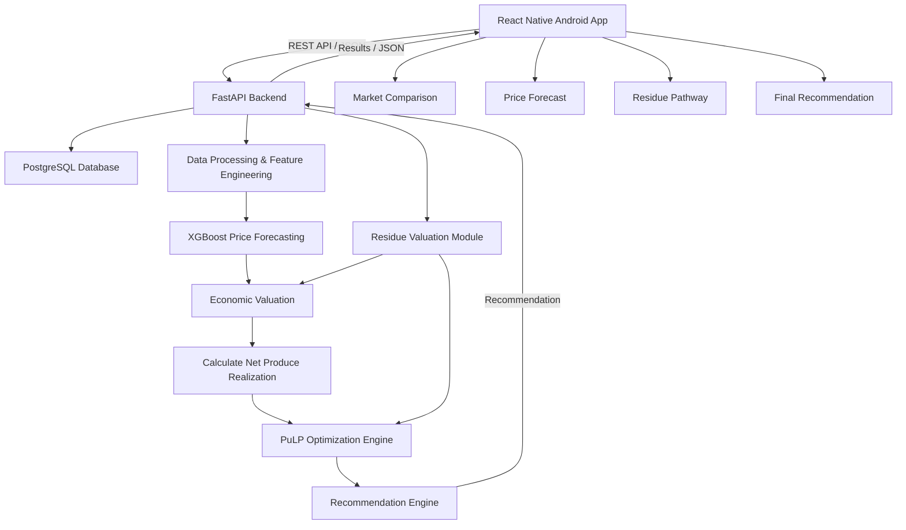

# AgriValue - High-Level Design

## System Architecture

## Component Overview

### React Native Android App
- Collects farmer and crop inputs
- Sends requests to the backend
- Displays market comparisons
- Displays price forecasts
- Displays residue pathway recommendations
- Displays the final recommendation

### FastAPI Backend
- Handles REST API requests
- Validates user inputs
- Coordinates data processing, forecasting, valuation, and optimization
- Returns results to the mobile application

### PostgreSQL Database
- Stores market data
- Stores crop-related information
- Stores forecast results and recommendation-related data

### Data Processing & Feature Engineering
- Cleans historical market data
- Filters data by crop and market
- Creates time-based features
- Prepares data for price forecasting

### XGBoost Price Forecasting
- Uses historical market data
- Generates expected prices for candidate markets

### Residue Valuation Module
- Estimates the value of available crop residue
- Evaluates possible residue utilization pathways

### Economic Valuation
- Combines forecasted prices, produce quantity, and applicable costs
- Calculates expected economic value

### PuLP Optimization Engine
- Compares feasible market and residue pathway combinations
- Considers relevant constraints
- Selects the combination that maximizes expected total value

### Recommendation Engine
- Converts the optimization result into a farmer-facing recommendation
- Returns the recommended market, residue pathway, and expected values