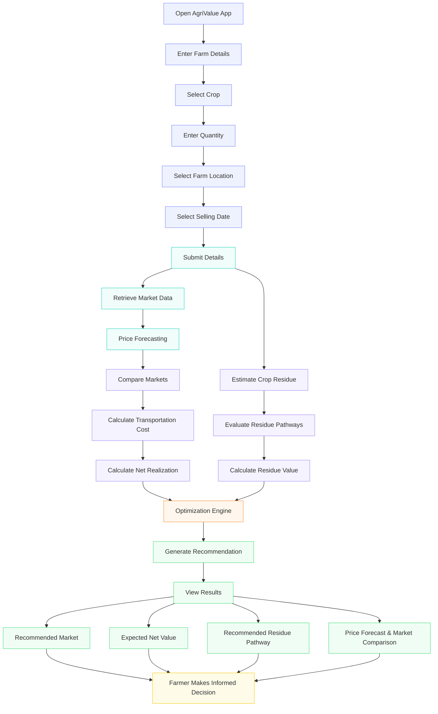

# AgriValue User Flow

```mermaid
flowchart TD

    A[Open AgriValue App] --> B[Enter Farm Details]
    B --> C[Select Crop]
    C --> D[Enter Quantity]
    D --> E[Select Farm Location]
    E --> F[Select Selling Date]
    F --> G[Submit Details]

    G --> H[Retrieve Market Data]
    H --> I[Price Forecasting]
    I --> J[Compare Markets]
    J --> K[Calculate Transportation Cost]
    K --> L[Calculate Net Realization]

    G --> M[Estimate Crop Residue]
    M --> N[Evaluate Residue Pathways]
    N --> O[Calculate Residue Value]

    L --> P[Optimization Engine]
    O --> P

    P --> Q[Generate Recommendation]
    Q --> R[View Results]

    R --> S[Recommended Market]
    R --> T[Expected Net Value]
    R --> U[Recommended Residue Pathway]
    R --> V[Price Forecast & Market Comparison]

    S --> W[Farmer Makes Informed Decision]
    T --> W
    U --> W
    V --> W

    classDef inputStep stroke:#818cf8,fill:#eef2ff
    classDef dataProcess stroke:#2dd4bf,fill:#f0fdfa
    classDef calculation stroke:#a78bfa,fill:#f5f3ff
    classDef engine stroke:#fb923c,fill:#fff7ed
    classDef output stroke:#4ade80,fill:#f0fdf4
    classDef decision stroke:#facc15,fill:#fefce8

    class A,B,C,D,E,F inputStep
    class G,H,I dataProcess
    class J,K,L,M,N,O calculation
    class P engine
    class Q,R,S,T,U,V output
    class W decision
```